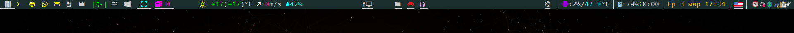
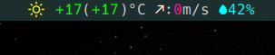
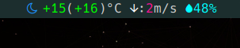

# Weather status for Xmobar

Here I share my small script for making weather report in the Xmobar.







String format is: `<weather icon> <temperature in °C>(<feel like temperature in °C>)°C <wind direction>:<wind speed in meters per second>m/s <air humidity %>%`.
And each value is wrapped in its own color with `<fc="color"> item </fc>` command for Xmobar.

Final output looks like this:

```
<fc=#FFFF00> </fc> <fc=green>+17</fc>(<fc=green>+17</fc>)°C <fc=white></fc>:<fc=#FF1493>0</fc>m/s <fc=cyan>42%</fc>
```

> The source of weather data is [wttr.in](http://wttr.in) web-site, which is produced by this awesome project: [chubin/wttr.in](https://github.com/chubin/wttr.in).

## Motivation

I like Xmobar panel but it has issues with supporting of different colorful emoji icons. And while `wttr.in` allows to produce quite useful pre-formatted weather reports (`curl -s wttr.in/Bonn?format=4`) which I could feed directly in the status bar, but unfortunately `Noto Color Emoji` icons used there are not displayed by Xmobar.

And I decided to write my own script as a workaround.  Script is in Python because `wttr.in` can give away information in JSON format. And processing of JSON in Python is quick and easy.

# How it works

## Prerequisites

- Running Xmobar (of course, this assumes you most probably use Xmonad window manager)
- Installed one of [Nerd Fonts](https://nerdfonts.com) for use in the Xmobar.
    - I use **Hack Nerd Font**.
- `cron` for regular weather updates
- `python3` has to be installed

## Implementation logic

I want to have update of the weather status on the bar every minute while I want to keep number of requests to server as low as possible.

Here is what I do:

1. I place my scripts in the `~/.scripts` directory. Hence, my `weather-xmobar.py` script is placed there.
    - You can put it in any directory you put your own scripts.
2. My `weather-xmobar.py` script runs every 30 min via `cron`. And output is printed into the `/tmp/weather` file. (You can define any interval you like).
3. Xmobar reads status from `/tmp/weather` file every 10 seconds.
4. In my `.xprofile` I produce initial `/tmp/weather` file after boot and login. This is needed to avoid error on Xmobar because after login:
    - Internet connection is not yet available.
    - Therefore `/tmp/weather` file does not exist and I have to create it.

> I prefer use of `/tmp` because it is `tmpfs` built in RAM. Hence reading and writing there does is very fast and also do not use any SSD resource.

## Config files

### `crontab -e` config:

```sh
# {min} {hour} {day of month} {month} {day of week}     command to be executed
*/30 * * * *        ~/.scripts/weather-xmobar.py > /tmp/weather
```

### `Xmobar` config (partial)

```haskell
...
Config {
    , font = "xft:Hack Nerd Font:style=Regular:pixelsize=16:antialias=true:hinting=light"
    , additionalFonts = [ "xft:Font Awesome 5 Free:style=Solid:pixelsize=16:antialias=true"
                        ]
    , border = NoBorder
    , bgColor = "#1D3030"
    , fgColor = "#D0D0D0"
    , alpha = 245
    ...
    , commands = [ Run UnsafeStdinReader
                   , Run Com "cat" ["/tmp/weather"] "weather" 100
                   ...
                 ]
    , template = "... %UnsafeStdinReader%     <action=`~/.scripts/weather-report.py > /tmp/weather`>%weather%</action>  ..."
    }
```

`action` allows to update status on demand, e.g. if after boot it shows status as **N/A**. Just click on the status text on the Xmobar.

### `.xprofile` initiation line

Instead of simple `cat "____N/A____" > /tmp/weather` I use my script because it also gives additional information about error. 

```sh
~/.scripts/weather-xmobar.py > /tmp/weather &
```

### The script itself

Script you can find [here](scripts/weather-xmobar.py)
